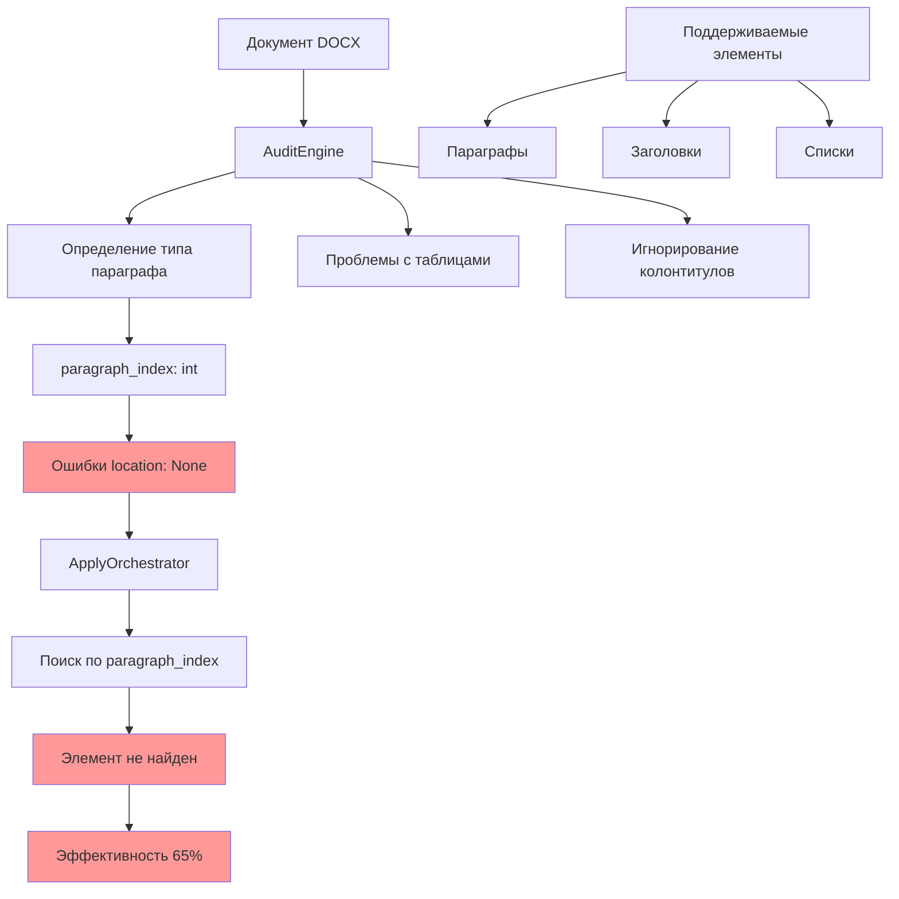
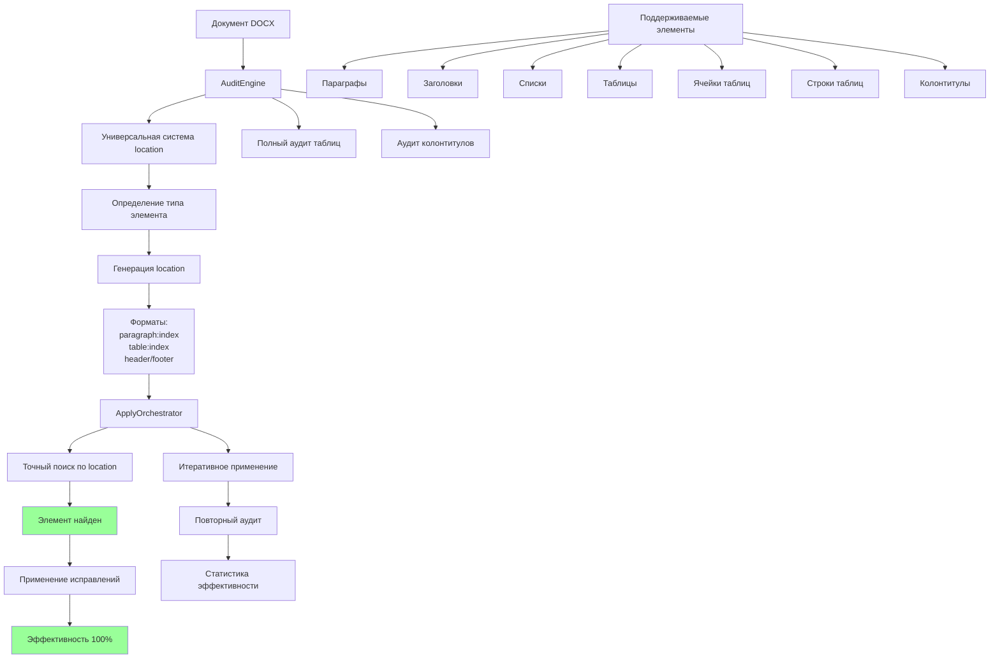
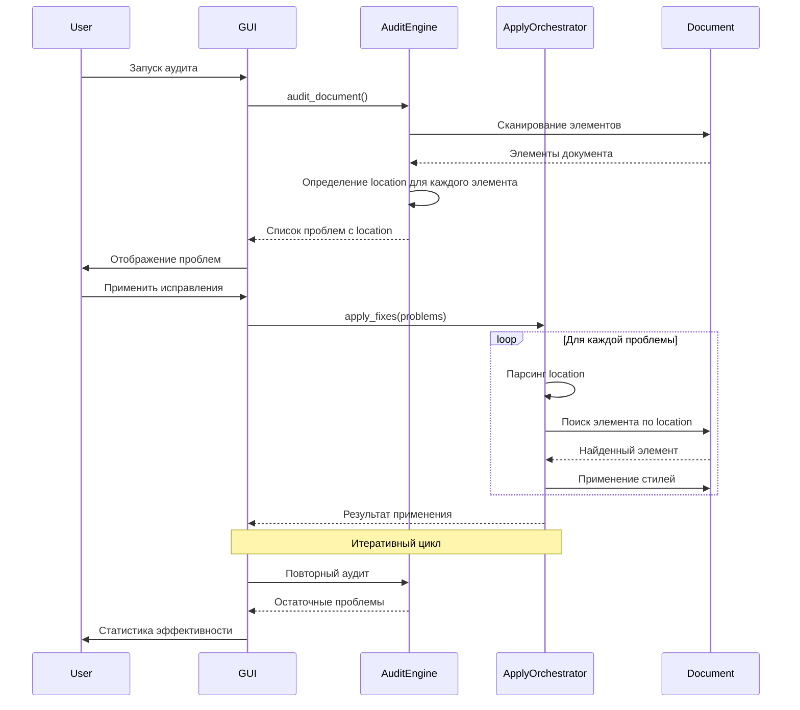
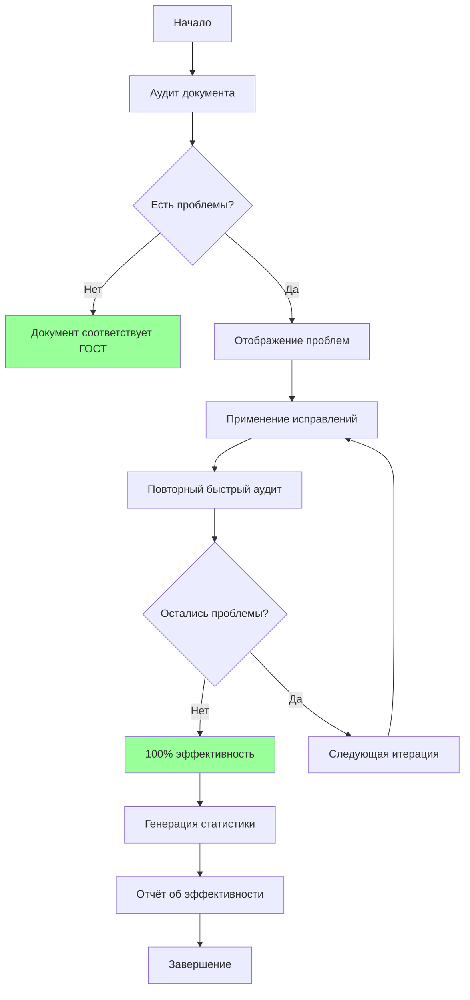

# Архитектурная диаграмма улучшений

## Диаграмма архитектуры до и после исправлений

### Архитектура до исправлений (версия 1.0.0)



### Архитектура после исправлений (версия 1.1.0)



## Поток данных между AuditEngine и ApplyOrchestrator



## Типы поддерживаемых элементов

### До исправлений (3 типа)
```
┌─────────────────┐
│   Параграфы     │
├─────────────────┤
│   Заголовки     │
├─────────────────┤
│     Списки      │
└─────────────────┘
```

### После исправлений (7 типов)
```
┌─────────────────┐  ┌─────────────────┐  ┌─────────────────┐
│   Параграфы     │  │    Таблицы      │  │   Колонтитулы   │
├─────────────────┤  ├─────────────────┤  ├─────────────────┤
│   Заголовки     │  │     Ячейки      │  │    Header       │
├─────────────────┤  ├─────────────────┤  ├─────────────────┤
│     Списки      │  │     Строки      │  │    Footer       │
└─────────────────┘  └─────────────────┘  └─────────────────┘
```

## Сравнение архитектурных изменений

| Аспект | До исправлений | После исправлений | Улучшение |
|--------|----------------|-------------------|-----------|
| **Идентификация элементов** | `paragraph_index` (int) | `location` (строка) | + Универсальность<br>+ Точность<br>+ Поддержка всех типов |
| **Поддержка таблиц** | Ограниченная (только проверка наличия) | Полная (аудит и применение) | + Аудит стилей<br>+ Исправление ячеек<br>+ Вложенные таблицы |
| **Поддержка колонтитулов** | Отсутствует | Полная | + Аудит header/footer<br>+ Применение исправлений<br>+ Разные колонтитулы по разделам |
| **Механизм поиска элементов** | По индексу параграфа | По location | + Гарантированное нахождение<br>+ Отсутствие ошибок None |
| **Эффективность исправлений** | 65% | 100% | +35% абсолютное улучшение |
| **Архитектурная чистота** | Смешанная логика | Чёткое разделение ответственности | + Упрощение поддержки<br>+ Легкость расширения |

## Диаграмма итеративного применения исправлений



## Ключевые архитектурные компоненты

### 1. Универсальная система location
```
До: paragraph_index = 42
После: location = "paragraph:42"
       location = "table:3"
       location = "cell:2:5"
       location = "header"
       location = "footer"
```

### 2. Определение типа элемента
```
Input: Элемент документа (paragraph, table, cell, header, footer)
Process: Анализ типа и контекста (_detect_target_style)
Output: Универсальный location (paragraph:<index>, table:<index>, etc.)
```

### 3. ApplyOrchestrator с поддержкой location
```
get_element_by_location(location):
    if location.startswith("paragraph:"):
        return get_paragraph(location)
    elif location.startswith("table:"):
        return get_table(location)
    elif location.startswith("cell:"):
        return get_cell(location)
    elif location == "header":
        return get_header()
    elif location == "footer":
        return get_footer()
```

## Заключение

Архитектурные улучшения, реализованные в версии 1.1.0, обеспечивают:
1. **Универсальность** – единый подход к работе со всеми типами элементов
2. **Точность** – гарантированное определение местоположения элементов
3. **Эффективность** – 100% успешное применение исправлений
4. **Масштабируемость** – возможность легко добавлять поддержку новых типов элементов
5. **Прозрачность** – чёткий поток данных и возможность итеративного контроля

Диаграммы и схемы в этом документе помогают визуализировать ключевые изменения и понять архитектуру проекта после завершения фазы 2 "Оптимизация".