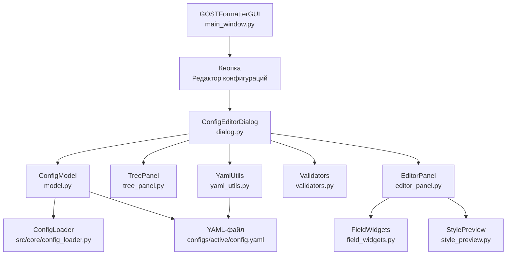
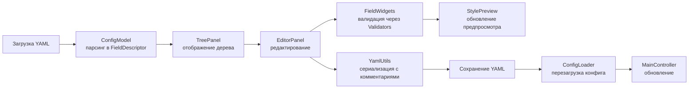

# План реализации: Редактор конфигураций с GUI

## 1. Обзор

**Цель:** Создать визуальный редактор YAML-конфигураций ГОСТ-форматирования с предпросмотром стилей, интегрированный в существующее Tkinter-приложение.

**Ключевые требования:**
- Визуальное редактирование всех секций YAML-конфига (styles, detection_rules, page_setup, headers_footers, formatting_rules, validation, federal_regional_projects)
- Древовидное отображение структуры конфига
- Редактирование полей через типизированные виджеты (числа, строки, булевы, enum, цвета)
- Предпросмотр стилей (шрифт, цвет, выравнивание, отступы)
- Валидация вводимых значений
- Сохранение в YAML с сохранением комментариев
- Интеграция с существующим GUI через кнопку "Редактор конфигураций"

---

## 2. Архитектура

### 2.1. Общая структура модуля

Новый модуль `src/config_editor/` — полностью независимый пакет, который импортируется и вызывается из основного GUI.

```
src/config_editor/
  __init__.py              # Экспорт главного класса ConfigEditorDialog
  model.py                 # Модель данных: ConfigModel, FieldDescriptor, StyleDescriptor
  field_widgets.py         # Типизированные виджеты для редактирования полей
  style_preview.py         # Компонент предпросмотра стиля (Canvas)
  tree_panel.py            # Дерево конфига (левая панель)
  editor_panel.py          # Панель редактирования (правая панель)
  validators.py            # Валидаторы значений
  yaml_utils.py            # Утилиты для работы с YAML (сохранение с комментариями)
  dialog.py                # Главное диалоговое окно редактора
```

### 2.2. Схема интеграции с существующим кодом



### 2.3. Поток данных



---

## 3. Детальная спецификация компонентов

### 3.1. `model.py` — Модель данных

#### Класс `FieldType` (enum)
Типы полей для маппинга на виджеты:
- `STRING` — текстовая строка
- `NUMBER` — число (int или float)
- `BOOLEAN` — true/false
- `ENUM` — выбор из списка значений
- `COLOR` — цвет (строка "black", "#FF0000")
- `ALIGNMENT` — выравнивание (left, center, right, justify)
- `TEXT_TRANSFORM` — трансформация текста (capitalize, uppercase, lowercase, none)
- `LINE_SPACING` — межстрочный интервал (float-множитель или число pt)
- `DICTIONARY` — вложенный словарь
- `LIST` — список строк/чисел

#### Класс `FieldDescriptor`
Описывает одно поле конфига:
```python
@dataclass
class FieldDescriptor:
    key: str                    # Ключ в YAML (например, "font.size")
    label: str                  # Человеческое название (например, "Размер шрифта")
    field_type: FieldType       # Тип поля
    value: Any                  # Текущее значение
    default: Any = None         # Значение по умолчанию
    enum_values: List[str] = None  # Для ENUM-полей
    min_value: float = None     # Для NUMBER — минимум
    max_value: float = None     # Для NUMBER — максимум
    unit: str = None            # Единица измерения ("pt", "cm", "twips")
    description: str = ""       # Описание/комментарий из YAML
    required: bool = True       # Обязательное поле
    children: Dict[str, 'FieldDescriptor'] = None  # Вложенные поля
```

#### Класс `StyleDescriptor`
Описывает один стиль (наследник или композиция FieldDescriptor):
```python
@dataclass
class StyleDescriptor:
    name: str                   # Имя стиля (Normal, Heading 1, ...)
    enabled: bool               # enabled
    font: Dict[str, FieldDescriptor]  # Поля шрифта
    paragraph: Dict[str, FieldDescriptor]  # Поля абзаца
    table: Dict[str, FieldDescriptor] = None  # Поля таблицы (опционально)
    position: Dict[str, FieldDescriptor] = None  # Позиция (для Header/Footer)
    content: Dict[str, FieldDescriptor] = None  # Контент (для Header/Footer)
```

#### Класс `ConfigModel`
Центральная модель, загружает конфиг и предоставляет доступ к полям:
```python
class ConfigModel:
    def __init__(self, config_path: str)
    def load(self) -> bool
    def get_styles(self) -> Dict[str, StyleDescriptor]
    def get_section(self, name: str) -> Dict[str, FieldDescriptor]
    def get_field(self, path: str) -> FieldDescriptor
    def set_field(self, path: str, value: Any) -> bool
    def validate(self) -> List[ValidationError]
    def to_dict(self) -> Dict[str, Any]
    def save(self) -> bool
```

### 3.2. `field_widgets.py` — Типизированные виджеты

Фабрика виджетов, создающая соответствующий элемент управления для каждого `FieldType`:

| FieldType | Виджет | Поведение |
|-----------|--------|-----------|
| `STRING` | `ttk.Entry` | Текстовое поле |
| `NUMBER` | `ttk.Entry` + валидация | Только цифры, проверка min/max |
| `BOOLEAN` | `ttk.Checkbutton` | Чекбокс |
| `ENUM` | `ttk.Combobox` | Выпадающий список |
| `COLOR` | `ttk.Button` + Color Chooser | Кнопка с цветным индикатором, открывает `tk.colorchooser` |
| `ALIGNMENT` | `ttk.Combobox` | left/center/right/justify |
| `TEXT_TRANSFORM` | `ttk.Combobox` | capitalize/uppercase/lowercase/none |
| `LINE_SPACING` | `ttk.Entry` + подсказка | Число, пояснение (множитель или pt) |
| `DICTIONARY` | Вложенная рамка | Рекурсивное отображение дочерних полей |
| `LIST` | `tk.Listbox` + кнопки Add/Remove | Список с управлением |

**Класс `FieldWidgetFactory`:**
```python
class FieldWidgetFactory:
    @staticmethod
    def create(parent, descriptor: FieldDescriptor, on_change: Callable) -> ttk.Widget
    @staticmethod
    def get_value(widget, descriptor: FieldDescriptor) -> Any
    @staticmethod
    def set_value(widget, descriptor: FieldDescriptor, value: Any)
```

### 3.3. `style_preview.py` — Предпросмотр стиля

Компонент для визуализации настроек стиля в реальном времени.

**Техническая реализация:**
- Использует `tk.Canvas` для отрисовки
- Показывает образец текста с применёнными настройками шрифта
- Отображает линейку отступов (визуальная шкала)
- Показывает выравнивание (линии, обозначающие границы)

**Класс `StylePreview`:**
```python
class StylePreview(ttk.Frame):
    def __init__(self, parent)
    def update(self, style_descriptor: StyleDescriptor)
    def _draw_font_sample(self, font_cfg)
    def _draw_alignment_indicator(self, alignment)
    def _draw_indent_ruler(self, indent_cm)
    def _draw_color_swatch(self, color)
    def clear(self)
```

**Что отображается:**
1. **Образец шрифта** — текст "AaBbCc 123" с указанным шрифтом, размером, жирностью, курсивом, цветом
2. **Индикатор выравнивания** — схематичное отображение (линии разной длины: left — слева, center — по центру, right — справа, justify — по ширине)
3. **Линейка отступов** — горизонтальная шкала с отметкой красной строки
4. **Информация о межстрочном интервале** — схематичные линии с расстоянием

### 3.4. `tree_panel.py` — Дерево конфига

Левая панель редактора, отображающая структуру конфига в виде дерева.

**Класс `TreePanel`:**
```python
class TreePanel(ttk.Frame):
    def __init__(self, parent, model: ConfigModel, on_select: Callable)
    def build_tree(self)
    def expand_all(self)
    def collapse_all(self)
    def select_node(self, path: str)
    def get_selected_path(self) -> str
```

**Структура дерева:**
```
Конфигурация
  +-- Стили
  |   +-- Normal
  |   |   +-- Шрифт
  |   |   |   +-- name: Times New Roman
  |   |   |   +-- size: 12
  |   |   |   +-- bold: false
  |   |   |   +-- italic: false
  |   |   |   +-- color: black
  |   |   +-- Абзац
  |   |       +-- first_line_indent_cm: 1.25
  |   |       +-- line_spacing: 1.15
  |   |       +-- space_before_pt: 0
  |   |       +-- space_after_pt: 0
  |   |       +-- alignment: justify
  |   +-- Heading 1
  |   +-- Heading 2
  |   +-- ... (все стили)
  |   +-- Footer
  +-- Правила определения
  |   +-- Heading 1
  |   +-- Heading 2
  |   +-- ...
  +-- Настройки страницы
  |   +-- portrait
  |   +-- landscape
  |   +-- paper_size: A4
  |   +-- orientation_default: portrait
  +-- Колонтитулы
  |   +-- header
  |   +-- footer
  +-- Правила форматирования
  |   +-- prohibited
  |   +-- headings
  |   +-- tables
  |   +-- figures
  |   +-- notes
  |   +-- numbering
  +-- Валидация
  +-- Федеральные/региональные проекты
```

### 3.5. `editor_panel.py` — Панель редактирования

Правая панель, отображающая поля выбранного узла дерева.

**Класс `EditorPanel`:**
```python
class EditorPanel(ttk.Frame):
    def __init__(self, parent, model: ConfigModel, preview: StylePreview)
    def show_fields(self, path: str, descriptor: Union[StyleDescriptor, FieldDescriptor])
    def clear(self)
    def _build_form(self, fields: Dict[str, FieldDescriptor])
    def _on_field_change(self, field_path: str, value: Any)
    def get_modified_fields(self) -> List[str]
```

**Поведение:**
- При выборе стиля в дереве — показывает все поля стиля (font, paragraph, table) сгруппированными
- При выборе "Шрифт" внутри стиля — показывает только поля шрифта
- При выборе "Абзац" — показывает только поля абзаца
- При выборе секции (например, "Настройки страницы") — показывает поля секции
- Каждое поле отображается в виде строки: [label] [widget] [unit] [description]
- Изменения применяются немедленно к модели и предпросмотру

### 3.6. `validators.py` — Валидаторы

**Класс `Validators`:**
```python
class ValidationError:
    field_path: str
    message: str
    severity: Literal["error", "warning"]

class Validators:
    @staticmethod
    def validate_string(value, descriptor) -> List[ValidationError]
    @staticmethod
    def validate_number(value, descriptor) -> List[ValidationError]
    @staticmethod
    def validate_enum(value, descriptor) -> List[ValidationError]
    @staticmethod
    def validate_color(value) -> List[ValidationError]
    @staticmethod
    def validate_all(model: ConfigModel) -> List[ValidationError]
```

**Правила валидации:**
- `font.size`: число, 1-100, целое
- `font.name`: непустая строка
- `first_line_indent_cm`: число, 0-10
- `line_spacing`: число, 0.5-5.0 (множитель) или 1-100 (pt)
- `space_before_pt`, `space_after_pt`: число, >= 0
- `color`: допустимое имя цвета или HEX (#RGB, #RRGGBB)
- `alignment`: одно из left, center, right, justify
- `enabled`: булево

### 3.7. `yaml_utils.py` — Утилиты YAML

**Класс `YamlUtils`:**
```python
class YamlUtils:
    @staticmethod
    def load_with_comments(path: str) -> Tuple[Dict, List[str]]
    @staticmethod
    def save_with_comments(path: str, data: Dict, comments: Dict[str, str]) -> bool
    @staticmethod
    def extract_comments(yaml_text: str) -> Dict[str, str]
    @staticmethod
    def merge_comments(data: Dict, comments: Dict[str, str]) -> str
```

**Проблема:** Стандартный `yaml.dump()` не сохраняет комментарии.
**Решение:** Использовать `ruamel.yaml` (если доступен) или реализовать кастомный дампер, который:
1. При загрузке извлекает комментарии (строки, начинающиеся с `#`)
2. Хранит их в отдельном словаре с ключами-путями
3. При сохранении вставляет комментарии обратно

**Альтернатива:** Если `ruamel.yaml` нежелателен, можно использовать подход с шаблонизацией:
- Загрузить YAML как текст
- Извлечь структуру через `yaml.safe_load`
- После редактирования применить изменения через regex-замену к исходному тексту
- Это сохранит все комментарии и форматирование

### 3.8. `dialog.py` — Главное диалоговое окно

**Класс `ConfigEditorDialog`:**
```python
class ConfigEditorDialog:
    def __init__(self, parent, controller: MainController)
    def show(self)
    def _build_ui(self)
    def _on_tree_select(self, event)
    def _on_save(self)
    def _on_save_as(self)
    def _on_cancel(self)
    def _show_validation_errors(self, errors: List[ValidationError])
```

**Макет окна (1200x800):**

```
+------------------------------------------------------------------+
| [Название: Редактор конфигураций - config.yaml]          [X]     |
+--------------------------------+---------------------------------+
|                                |  [Стиль: Normal]                |
|  Конфиг                       +---------------------------------+
|  +-- Стили                    |  [x] Включён                    |
|  |   +-- Normal               |                                 |
|  |   +-- Heading 1            |  +-- Шрифт -------------------+ |
|  |   +-- Heading 2            |  | Имя: [Times New Roman   v] | |
|  |   +-- ...                  |  | Размер: [12] pt           | |
|  +-- Правила определения      |  | Жирный: [ ]               | |
|  +-- Настройки страницы       |  | Курсив: [ ]               | |
|  +-- Колонтитулы              |  | Цвет: [черный]            | |
|  +-- Правила форматирования   |  +----------------------------+ |
|  +-- Валидация                |                                 |
|  +-- Федеральные/регион.      |  +-- Абзац -------------------+ |
|                                |  | Отступ: [1.25] см         | |
|                                |  | Интервал: [1.15] множит.  | |
|                                |  | Перед: [0] pt             | |
|                                |  | После: [0] pt             | |
|                                |  | Выравн.: [justify     v]  | |
|                                |  +----------------------------+ |
|                                |                                 |
|                                |  +-- Предпросмотр -----------+ |
|                                |  | Lorem ipsum dolor sit amet | |
|                                |  | consectetur adipiscing     | |
|                                |  | <--- 1.25 см --->         | |
|                                |  +----------------------------+ |
+--------------------------------+---------------------------------+
|  [Сохранить] [Сохранить как...] [Отмена]                        |
+------------------------------------------------------------------+
```

---

## 4. Интеграция с существующим GUI

### 4.1. Кнопка вызова редактора

В `main_window.py` (или `gui_formatter.py`) в панель действий (`action_frame`) добавить кнопку:

```python
self.btn_config_editor = ttk.Button(
    action_frame, 
    text="Редактор конфигураций", 
    command=self.open_config_editor
)
self.btn_config_editor.pack(side=tk.LEFT, padx=5)
```

### 4.2. Метод `open_config_editor` в `GOSTFormatterGUI`

```python
def open_config_editor(self):
    """Открывает редактор конфигураций."""
    from src.config_editor.dialog import ConfigEditorDialog
    dialog = ConfigEditorDialog(self.root, self.controller)
    dialog.show()
    # После закрытия редактора - перезагрузить конфиг в контроллере
    if dialog.is_saved:
        self._load_config()
        self._sync_ui_with_controller()
        self.log("Конфигурация обновлена через редактор")
```

### 4.3. Обновление `MainController`

Добавить метод для перезагрузки конфига:

```python
def reload_config(self, config_path: str = None) -> bool:
    """Перезагружает конфигурацию из файла."""
    if config_path:
        self.config_path = config_path
    return self._load_config()
```

---

## 5. План реализации по шагам

### Шаг 1: Создание структуры модуля и модели данных
**Файлы:** `src/config_editor/__init__.py`, `src/config_editor/model.py`

- Создать пакет `src/config_editor/`
- Реализовать `FieldType` (enum)
- Реализовать `FieldDescriptor` (dataclass)
- Реализовать `StyleDescriptor` (dataclass)
- Реализовать `ConfigModel` — загрузка из `ConfigLoader`, построение дерева дескрипторов
- Написать тесты для модели

### Шаг 2: Утилиты YAML с сохранением комментариев
**Файлы:** `src/config_editor/yaml_utils.py`

- Реализовать загрузку YAML с извлечением комментариев
- Реализовать сохранение с комментариями (через `ruamel.yaml` или текстовую замену)
- Написать тесты на round-trip (загрузить -> изменить -> сохранить -> загрузить -> проверить)

### Шаг 3: Валидаторы
**Файлы:** `src/config_editor/validators.py`

- Реализовать все статические методы валидации
- Реализовать `validate_all` для полной проверки конфига
- Написать тесты для каждого валидатора

### Шаг 4: Типизированные виджеты
**Файлы:** `src/config_editor/field_widgets.py`

- Реализовать `FieldWidgetFactory` с созданием виджетов для всех `FieldType`
- Реализовать виджет выбора цвета (кнопка + `tk.colorchooser`)
- Реализовать числовое поле с валидацией ввода
- Написать тесты (визуальная проверка)

### Шаг 5: Компонент предпросмотра стилей
**Файлы:** `src/config_editor/style_preview.py`

- Реализовать `StylePreview` на `tk.Canvas`
- Отрисовка образца шрифта (текст с заданными параметрами)
- Отрисовка индикатора выравнивания
- Отрисовка линейки отступов
- Интеграция: обновление при изменении полей стиля

### Шаг 6: Дерево конфига
**Файлы:** `src/config_editor/tree_panel.py`

- Реализовать `TreePanel` на `ttk.Treeview`
- Построение дерева из `ConfigModel`
- Иконки для разных типов узлов
- Обработка выбора узла

### Шаг 7: Панель редактирования
**Файлы:** `src/config_editor/editor_panel.py`

- Реализовать `EditorPanel`
- Динамическое построение формы по `FieldDescriptor`
- Группировка полей (font, paragraph, table)
- Привязка изменений к модели и предпросмотру

### Шаг 8: Главное диалоговое окно
**Файлы:** `src/config_editor/dialog.py`

- Реализовать `ConfigEditorDialog`
- Компоновка: дерево слева, редактор + предпросмотр справа
- Кнопки Save / Save As / Cancel
- Отображение ошибок валидации
- Интеграция с `MainController` (перезагрузка конфига после сохранения)

### Шаг 9: Интеграция с основным GUI
**Файлы:** `src/gui/main_window.py` (или `gui_formatter.py`)

- Добавить кнопку "Редактор конфигураций" в `action_frame`
- Реализовать метод `open_config_editor`
- Добавить метод `reload_config` в `MainController`
- Проверить, что после сохранения конфига через редактор, аудит работает с новыми настройками

### Шаг 10: Тестирование и отладка
- Тестирование загрузки существующего `config.yaml` (726 строк, ~20 стилей)
- Тестирование редактирования каждого типа поля
- Тестирование сохранения с комментариями
- Тестирование предпросмотра для разных стилей
- Тестирование интеграции: открыть редактор -> изменить стиль -> сохранить -> запустить аудит -> проверить результат
- Тестирование граничных случаев: пустой конфиг, конфиг без комментариев, конфиг с ошибками

---

## 6. Зависимости

### Существующие (из `requirements.txt`):
- `PyYAML>=6.0` — парсинг YAML
- `python-docx>=0.8.11` — работа с DOCX (не требуется напрямую, но используется для контекста)
- `ttkthemes>=3.2.2` — темы для ttk

### Новые зависимости (опционально):
- `ruamel.yaml>=0.17.0` — для сохранения YAML с комментариями (рекомендуется)
- Если `ruamel.yaml` не используется — реализовать кастомный дампер

---

## 7. Критерии готовности (Definition of Done)

1. Редактор открывается из основного GUI по кнопке
2. Дерево конфига отображает все секции и стили из `config.yaml`
3. Выбор узла в дереве показывает соответствующие поля в панели редактирования
4. Все типы полей корректно редактируются (строки, числа, булевы, enum, цвета)
5. Предпросмотр стиля обновляется в реальном времени при изменении полей
6. Валидация предотвращает сохранение некорректных значений
7. Сохранение сохраняет все комментарии YAML-файла
8. После сохранения конфиг перезагружается в `MainController`
9. Аудит работает с обновлённым конфигом без перезапуска приложения
10. Все тесты проходят

---

## 8. Диаграмма последовательности

```
User -> GUI: Нажать Редактор конфигураций
GUI -> Dialog: open_config_editor()
Dialog -> Model: ConfigModel(config_path)
Model -> YAML: load_with_comments(path)
YAML -> Model: data, comments
Model -> Model: parse to FieldDescriptors
Dialog -> Tree: build_tree(model)
Dialog -> Editor: show_fields(root)
Dialog -> Preview: clear()

User -> Tree: Выбрать стиль Normal
Tree -> Dialog: on_select(path=styles.Normal)
Dialog -> Editor: show_fields(styles.Normal)
Editor -> Preview: update(Normal_descriptor)
Preview -> Editor: canvas redrawn

User -> Editor: Изменить font.size с 12 на 14
Editor -> Model: set_field(font.size, 14)
Model -> Model: validate(font.size, 14)
Model -> Editor: valid
Editor -> Preview: update(Normal_descriptor)
Preview -> Editor: canvas redrawn with size 14

User -> Dialog: Нажать Сохранить
Dialog -> Model: validate_all()
Model -> Dialog: OK
Dialog -> YAML: save_with_comments(path, data, comments)
YAML -> Dialog: saved
Dialog -> GUI: is_saved = True
GUI -> Ctrl: reload_config()
Ctrl -> Ctrl: _load_config()
Ctrl -> GUI: config reloaded
GUI -> GUI: _sync_ui_with_controller()
```

---

## 9. Риски и их mitigation

| Риск | Вероятность | Влияние | Mitigation |
|------|------------|---------|------------|
| Потеря комментариев YAML при сохранении | Высокая | Среднее | Использовать `ruamel.yaml` или кастомный дампер с текстовой заменой |
| Сложность отображения вложенных структур в Tkinter | Средняя | Среднее | Использовать `ttk.LabelFrame` для группировки, скроллинг через `Canvas` |
| Производительность предпросмотра на Canvas | Низкая | Низкое | Обновлять только при изменении полей, не чаще 100ms |
| Конфликт с существующей кнопкой "Открыть для редактирования" | Низкая | Низкое | Новая кнопка открывает визуальный редактор, старая - внешний редактор |
| Размер окна редактора (1200x800) может не поместиться на маленьких экранах | Средняя | Низкое | Сделать окно resizeable, сохранять геометрию |

---

## 10. Оценка объёма работ (в строках кода)

| Компонент | Файл | Примерный объём |
|-----------|------|-----------------|
| Модель данных | `model.py` | ~250 строк |
| Утилиты YAML | `yaml_utils.py` | ~150 строк |
| Валидаторы | `validators.py` | ~120 строк |
| Типизированные виджеты | `field_widgets.py` | ~200 строк |
| Предпросмотр стилей | `style_preview.py` | ~180 строк |
| Дерево конфига | `tree_panel.py` | ~150 строк |
| Панель редактирования | `editor_panel.py` | ~200 строк |
| Главное диалоговое окно | `dialog.py` | ~250 строк |
| Интеграция | `main_window.py` (изменения) | ~30 строк |
| **Итого** | | **~1530 строк** |