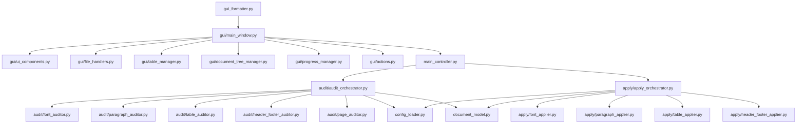

# План рефакторинга больших модулей

## Цель
Уменьшить размер модулей `gui_formatter.py` (1641 строк), `audit_engine.py` (910 строк), `apply_engine.py` (554 строк) путем разделения на подмодули, улучшить читаемость и поддерживаемость кода.

## Текущая структура

```
gui_formatter.py (1641 строк)
├── Класс GOSTFormatterGUI
│   ├── __init__ (инициализация UI)
│   ├── _init_ui (построение интерфейса)
│   ├── методы обработки файлов (browse_file, import_markdown, ...)
│   ├── методы аудита (start_audit_thread, highlight_issues, ...)
│   ├── методы исправлений (fix_selected, fix_all, ...)
│   ├── управление таблицей (apply_filter, toggle_select_all, ...)
│   ├── управление деревом документа (populate_doc_tree)
│   ├── логирование и прогресс (log, update_audit_progress)
│   └── вспомогательные методы
audit_engine.py (910 строк)
├── Класс AuditEngine
│   ├── методы проверки шрифтов
│   ├── методы проверки абзацев
│   ├── методы проверки таблиц
│   ├── методы проверки колонтитулов
│   ├── методы проверки страниц
│   └── общие утилиты
apply_engine.py (554 строки)
├── Класс ApplyEngine
│   ├── методы применения исправлений шрифтов
│   ├── методы применения исправлений абзацев
│   ├── методы применения исправлений таблиц
│   ├── методы применения исправлений колонтитулов
│   └── общие утилиты
```

## Предлагаемая структура после рефакторинга

### 1. Разделение gui_formatter.py

Создать подмодули в пакете `gui/`:

```
gui/
├── __init__.py
├── main_window.py          # Класс GOSTFormatterGUI (основной)
├── ui_components.py        # Классы для создания виджетов
├── file_handlers.py        # Обработчики файлов (browse, import, open)
├── table_manager.py        # Управление таблицей проблем
├── document_tree_manager.py # Управление деревом документа
├── progress_manager.py     # Управление прогрессом и логом
└── actions.py              # Обработчики действий (аудит, исправления)
```

**Основные изменения:**
- `GOSTFormatterGUI` остаётся в `main_window.py`, но делегирует ответственность подмодулям.
- Каждый подмодуль содержит соответствующие методы, которые принимают ссылку на главное окно или контроллер.

### 2. Разделение audit_engine.py

Создать пакет `audit/` с специализированными аудиторами:

```
audit/
├── __init__.py
├── base_auditor.py         # Базовый класс Auditor
├── font_auditor.py         # FontAuditor
├── paragraph_auditor.py    # ParagraphAuditor
├── table_auditor.py        # TableAuditor
├── header_footer_auditor.py # HeaderFooterAuditor
├── page_auditor.py         # PageAuditor
└── audit_orchestrator.py   # AuditEngine (координатор)
```

**Основные изменения:**
- `AuditEngine` становится `AuditOrchestrator`, который использует специализированные аудиторы.
- Каждый аудитор отвечает за проверку одной категории.

### 3. Разделение apply_engine.py

Создать пакет `apply/` с специализированными апплеерами:

```
apply/
├── __init__.py
├── base_applier.py         # Базовый класс Applier
├── font_applier.py         # FontApplier
├── paragraph_applier.py    # ParagraphApplier
├── table_applier.py        # TableApplier
├── header_footer_applier.py # HeaderFooterApplier
└── apply_orchestrator.py   # ApplyEngine (координатор)
```

**Основные изменения:**
- `ApplyEngine` становится `ApplyOrchestrator`, который использует специализированные апплеры.
- Каждый апплер отвечает за применение исправлений одной категории.

## Диаграмма зависимостей после рефакторинга



## Преимущества

1. **Уменьшение размера файлов**: Каждый модуль будет содержать 200-400 строк, что улучшает навигацию.
2. **Четкое разделение ответственности**: Каждый класс отвечает за одну область.
3. **Упрощение тестирования**: Можно тестировать аудиторов и апплеров по отдельности.
4. **Улучшение поддерживаемости**: Изменения в одной категории не затрагивают другие.
5. **Возможность повторного использования**: Аудиторы и апплеры могут использоваться независимо.

## План реализации

### Этап 1: Подготовка
1. Создать структуру директорий `gui/`, `audit/`, `apply/`.
2. Написать базовые классы (BaseAuditor, BaseApplier) с общими методами.

### Этап 2: Рефакторинг gui_formatter.py
1. Вынести UI компоненты в `ui_components.py`.
2. Вынести обработчики файлов в `file_handlers.py`.
3. Вынести управление таблицей в `table_manager.py`.
4. Вынести управление деревом документа в `document_tree_manager.py`.
5. Вынести логирование и прогресс в `progress_manager.py`.
6. Вынести обработчики действий в `actions.py`.
7. Обновить `main_window.py` для использования подмодулей.

### Этап 3: Рефакторинг audit_engine.py
1. Создать аудиторов для каждой категории.
2. Создать `audit_orchestrator.py` как координатор.
3. Обновить `AuditEngine` для использования новых аудиторов.

### Этап 4: Рефакторинг apply_engine.py
1. Создать апплеров для каждой категории.
2. Создать `apply_orchestrator.py` как координатор.
3. Обновить `ApplyEngine` для использования новых апплеров.

### Этап 5: Интеграция
1. Обновить импорты во всех модулях.
2. Обновить `main_controller.py` для работы с новыми классами.
3. Проверить, что все тесты проходят.

### Этап 6: Тестирование
1. Запустить существующие тесты.
2. Добавить unit-тесты для новых модулей.
3. Провести ручное тестирование GUI.

## Оценка рисков

1. **Время на рефакторинг**: Потребуется несколько дней.
2. **Возможные ошибки интеграции**: Необходимо тщательное тестирование.
3. **Совместимость с существующими конфигурациями**: Должна сохраниться.

## Следующие шаги

После утверждения плана можно приступить к реализации.