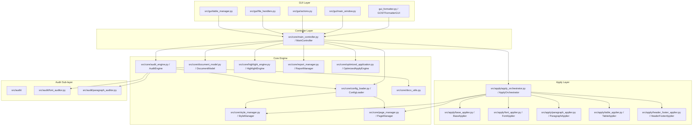
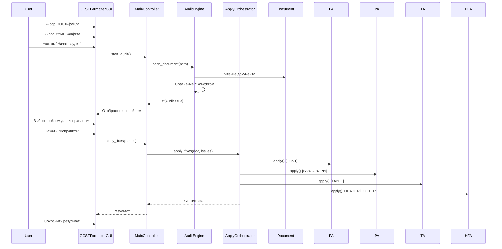

# Профиль проекта для SourceCraft Code Assistant

## 1. Общая информация о проекте

| Параметр | Значение |
|----------|----------|
| **Название** | Форматировщик документов по ГОСТ (Audit & Apply) |
| **Версия** | 1.1.0 (Фаза 2 "Оптимизация" завершена) |
| **Организация** | проектная организация |
| **Стандарты** | НТД 01-2013, ГОСТ Р 21.101-2020, ГОСТ 2.105-2019, ГОСТ 7.32-2017 |
| **Тип приложения** | Десктопное GUI-приложение + CLI-утилиты |
| **Язык** | Python 3.8+ |
| **Кодировка** | UTF-8 (все файлы) |
| **Язык интерфейса** | Русский (GUI, документация, комментарии в коде) |

---

## 2. Технологический стек

### 2.1. Язык программирования
- **Python 3.8+** — единственный язык проекта
- **Типизация**: постепенная (gradual typing) через `typing` модуль
- **Стиль**: PEP 8 с русскоязычными комментариями и docstring

### 2.2. Основные зависимости
| Пакет | Версия | Назначение |
|-------|--------|------------|
| `python-docx` | >=0.8.11 | Работа с DOCX-файлами (чтение, запись, стили) |
| `PyYAML` | >=6.0 | Загрузка YAML-конфигураций |
| `ttkthemes` | >=3.2.2 | Темы оформления Tkinter |
| `markdown` | >=3.4.0 | Конвертация Markdown → HTML (для md_to_docx) |
| `networkx` | (доп.) | Граф зависимостей для оптимизированного применения |

### 2.3. Среда выполнения
- **ОС**: Windows 10/11 (основная), кроссплатформенность не требуется
- **GUI-фреймворк**: Tkinter (ttk) — нативный для Windows
- **Сборка EXE**: PyInstaller (standalone portable-версия)
- **Логирование**: `logging` (файл `formatter.log` + stderr)

---

## 3. Архитектура проекта

### 3.1. Структура директорий

```
Formatter_modification/
├── gui_formatter.py              # Точка входа GUI (1641 строка)
├── md_to_docx.py                 # Конвертер Markdown → DOCX
├── requirements.txt              # Зависимости
├── 001.txt                       # Тестовые данные
├── README.md                     # Документация проекта
│
├── configs/                      # Конфигурационные YAML-файлы
│   └── active/
│       ├── config.yaml           # Основная конфигурация (726 строк)
│       ├── config_v3.2.yaml
│       └── config_v4.2.yaml
│
├── src/                          # Исходный код (пакет)
│   ├── __init__.py
│   │
│   ├── core/                     # Ядро приложения
│   │   ├── __init__.py
│   │   ├── main_controller.py    # Центральный контроллер (459 строк)
│   │   ├── config_loader.py      # Загрузчик YAML-конфигураций (136 строк)
│   │   ├── audit_engine.py       # Движок аудита (910 строк)
│   │   ├── document_model.py     # Абстракция над python-docx (200 строк)
│   │   ├── docx_utils.py         # Утилиты для работы с DOCX (219 строк)
│   │   ├── highlight_engine.py   # Подсветка проблем (150 строк)
│   │   ├── report_manager.py     # Управление отчётами (266 строк)
│   │   ├── style_manager.py      # Управление стилями (222 строки)
│   │   ├── page_manager.py       # Настройки страницы (215 строк)
│   │   └── optimized_application.py # Оптимизированное применение (368 строк)
│   │
│   ├── apply/                    # Применение исправлений
│   │   ├── __init__.py
│   │   ├── apply_orchestrator.py # Координатор (249 строк)
│   │   ├── base_applier.py       # Базовый класс (156 строк)
│   │   ├── font_applier.py       # Шрифты
│   │   ├── paragraph_applier.py  # Абзацы
│   │   ├── table_applier.py      # Таблицы
│   │   └── header_footer_applier.py # Колонтитулы
│   │
│   ├── audit/                    # Аудиторы (выделены из audit_engine)
│   │   ├── __init__.py
│   │   ├── base_auditor.py
│   │   ├── font_auditor.py
│   │   └── paragraph_auditor.py
│   │
│   └── gui/                      # GUI-компоненты
│       ├── __init__.py
│       ├── main_window.py        # Главное окно (копия gui_formatter.py)
│       ├── actions.py            # Обработчики действий
│       ├── file_handlers.py      # Обработчики файлов
│       └── table_manager.py      # Управление таблицей проблем
│
├── scripts/                      # Вспомогательные скрипты
│   ├── analysis/                 # Анализ результатов
│   ├── debug/                    # Отладка
│   ├── demo/                     # Демонстрация
│   ├── diagnostics/              # Диагностика
│   └── refactoring/              # Рефакторинг
│
├── tests/                        # Тесты
│   ├── stress/                   # Нагрузочное тестирование
│   └── unit/                     # Модульные и интеграционные тесты
│
├── docs/                         # Документация
│   ├── architecture/
│   ├── general/                  # CHANGELOG, TODO, PROJECT_STATUS
│   ├── plans/                    # Планы разработки
│   ├── reports/                  # Отчёты тестирования
│   └── user_guides/
│
├── apply/                        # (устаревший, для обратной совместимости)
├── audit/                        # (устаревший, для обратной совместимости)
├── data/                         # Данные
└── gui/                          # (устаревший, для обратной совместимости)
```

### 3.2. Архитектурная диаграмма



### 3.3. Поток данных (жизненный цикл)



---

## 4. Стиль кодирования и конвенции

### 4.1. Общие правила
- **Отступы**: 4 пробела (PEP 8)
- **Максимальная длина строки**: 120 символов (допускается до 150 для сложных выражений)
- **Кавычки**: двойные `"` для docstring, одиначные `'` для строк-ключей
- **Кодировка**: UTF-8 с `# -*- coding: utf-8 -*-` в заголовках
- **Импорты**: стандартная библиотека → сторонние → локальные (разделены пустой строкой)

### 4.2. Конвенции именования

| Элемент | Конвенция | Пример |
|---------|-----------|--------|
| **Модули/файлы** | `snake_case` | `config_loader.py`, `docx_utils.py` |
| **Классы** | `PascalCase` | `MainController`, `AuditEngine`, `ApplyOrchestrator` |
| **Методы** | `snake_case` | `scan_document()`, `apply_fixes()`, `_load_config()` |
| **Функции** | `snake_case` | `get_xml_attr_twips()`, `normalize_color()` |
| **Переменные** | `snake_case` | `doc_path`, `current_issues`, `style_cache` |
| **Константы** | `UPPER_SNAKE_CASE` | `CM_TO_TWIPS`, `PT_TO_TWIPS`, `MM_TO_TWIPS` |
| **Приватные** | `_префикс` | `_load_config()`, `_process_styles()` |
| **Защищённые** | `_префикс` | `_doc`, `_path` |
| **Пакеты** | `snake_case` | `src.core`, `src.apply`, `src.audit` |
| **Enum** | `PascalCase` | `Severity` (значения: `UPPER_CASE`) |
| **Dataclass** | `PascalCase` | `AuditIssue` |

### 4.3. Документирование
- **Docstring**: стиль PEP 257 (тройные двойные кавычки `"""`)
- **Язык**: русский (все комментарии, docstring, логи)
- **Формат docstring**: краткое описание → пустая строка → подробное описание → `:param:` / `:return:` / `:raises:`
- **Комментарии в коде**: русские, поясняющие "почему", а не "что"

### 4.4. Формат docstring (шаблон)
```python
"""
Краткое описание метода.

Подробное описание с пояснением логики.

:param param_name: Описание параметра
:type param_name: тип
:return: Описание возвращаемого значения
:rtype: тип
:raises ValueError: Когда ...
"""
```

### 4.5. Типизация
- Используется `typing` модуль: `List`, `Dict`, `Optional`, `Any`, `Tuple`, `Callable`
- Аннотации типов для всех публичных методов
- Для внутренних методов — опционально
- `Optional[str]` вместо `Union[str, None]`

---

## 5. Типы задач и сценарии использования

### 5.1. Основные типы задач

| Тип задачи | Частота | Примеры |
|------------|---------|---------|
| **Рефакторинг** | Высокая | Разделение больших модулей, выделение базовых классов, удаление дублирования |
| **Генерация кода** | Средняя | Новые апплеры/аудиторы, тесты, скрипты анализа |
| **Дебаггинг** | Высокая | Ошибки "None index", несоответствие location, проблемы с таблицами |
| **Оптимизация** | Средняя | Кэширование, группировка операций, снижение времени обработки |
| **Тестирование** | Высокая | Unit-тесты, интеграционные тесты, stress-тесты |
| **Документирование** | Средняя | README, CHANGELOG, TODO, архитектурные диаграммы |

### 5.2. Типичные паттерны изменений

1. **Добавление нового типа элемента** (например, "рисунок"):
   - Создать аудитор в `src/audit/`
   - Создать апплер в `src/apply/`
   - Добавить категорию в `AuditIssue.category`
   - Зарегистрировать в `ApplyOrchestrator`
   - Добавить тесты

2. **Изменение конфигурации**:
   - Добавить секцию в YAML
   - Обновить `ConfigLoader._process_styles()`
   - Обновить валидацию
   - Обновить тесты конфигурации

3. **Исправление бага в location**:
   - Найти проблемный `location` в `audit_engine.py`
   - Проверить парсинг в `base_applier.py`
   - Добавить тест на граничный случай
   - Проверить итеративное применение

---

## 6. Требования к безопасности

### 6.1. Работа с файлами
- **Исходный файл НИКОГДА не изменяется напрямую** — всегда создаётся копия
- **Бэкапы**: опция сохранения с `.bak` расширением
- **Валидация путей**: проверка существования файла перед открытием
- **Временные файлы**: создаются через `tempfile.mkstemp()` с автоматической очисткой

### 6.2. Обработка ошибок
- Все операции с документами обёрнуты в `try/except`
- Критические ошибки логируются с `exc_info=True`
- GUI не блокируется — длительные операции в отдельных потоках
- Пользователь получает понятные сообщения на русском языке

### 6.3. Конфигурация
- YAML-файлы проходят валидацию обязательных полей
- Некорректные значения конвертируются с предупреждением
- Поддержка fallback-значений по умолчанию

### 6.4. Потокобезопасность
- GUI-операции в главном потоке (через `root.after()`)
- Аудит и применение — в фоновых потоках
- Колбэки для обновления прогресса

---

## 7. Оптимальные настройки SourceCraft Code Assistant

### 7.1. Правила генерации кода

```yaml
# .sourcecraft/config.yaml
project_profile:
  name: "gost-formatter"
  language: "python"
  version: "3.8+"
  encoding: "utf-8"

code_generation:
  # Общие правила
  indentation: 4  # пробелы
  max_line_length: 120
  quote_style: "double"  # для docstring
  string_quote: "single"  # для строк

  # Импорты
  import_style: "explicit"  # избегать from module import *
  import_order:
    - "standard_library"
    - "third_party"
    - "local"
  group_imports: true

  # Документирование
  docstring_language: "russian"
  docstring_style: "pep257"
  require_docstring:
    - "class"
    - "public_method"
    - "public_function"
  comment_language: "russian"

  # Типизация
  typing_style: "gradual"
  require_type_hints:
    - "public_method"
    - "public_function"
  prefer_optional: true  # Optional[X] вместо Union[X, None]

  # Именование
  naming_conventions:
    classes: "PascalCase"
    functions: "snake_case"
    methods: "snake_case"
    variables: "snake_case"
    constants: "UPPER_SNAKE_CASE"
    private_prefix: "_"
    protected_prefix: "_"

  # Паттерны
  prefer_dataclass: true  # для моделей данных
  prefer_enums: true  # для фиксированных наборов значений
  error_handling: "try_except"  # явные блоки try/except
  logging: true  # добавлять логирование в новые модули

  # Запрещённые паттерны
  forbidden:
    - "global variables"
    - "wildcard imports (*)"
    - "bare except:"
    - "mutable default arguments"

completions:
  # Автодополнение
  context_window: 2000  # токенов контекста
  max_suggestions: 5
  suggest_imports: true
  suggest_docstrings: true
  suggest_type_hints: true

  # Приоритеты подсказок
  priority_patterns:
    - "docx.*"  # python-docx API
    - "AuditIssue"
    - "MainController"
    - "ConfigLoader"
    - "ApplyOrchestrator"
    - "location"  # система location
    - "twips"  # конвертация единиц

  # Шаблоны фрагментов (snippets)
  snippets:
    audit_issue:
      prefix: "auditissue"
      body: |
        self._create_issue(
            severity=Severity.${1:WARNING},
            category="${2:CATEGORY}",
            elem_type="${3:element_type}",
            loc={'index': ${4:index}},
            description="${5:description}",
            current_value="${6:current}",
            expected_value="${7:expected}"
        )

    applier_method:
      prefix: "applier"
      body: |
        def apply(self, doc: Document, issue: AuditIssue) -> bool:
            \"\"\"
            Применяет исправление ${1:category} к документу.

            :param doc: объект документа
            :param issue: проблема для исправления
            :return: True если успешно, False если ошибка
            \"\"\"
            try:
                ${2:# логика применения}
                return True
            except Exception as e:
                logger.error(f"Ошибка применения исправления {issue.id}: {e}")
                return False

    auditor_method:
      prefix: "auditor"
      body: |
        def _audit_${1:category}(self, doc: Document) -> None:
            \"\"\"
            Аудит ${2:описание категории}.

            :param doc: объект документа для аудита
            \"\"\"
            ${3:# логика аудита}

    test_method:
      prefix: "testmethod"
      body: |
        def test_${1:name}(self):
            \"\"\"Тест: ${2:описание}.\"\"\"
            ${3:# тело теста}

    location_dict:
      prefix: "location"
      body: |
        {
            'index': ${1:index},
            'page_estimate': ${2:page}
        }

    config_section:
      prefix: "configstyle"
      body: |
        ${1:StyleName}:
          enabled: true
          font:
            name: "Times New Roman"
            size: ${2:12}
            bold: false
            italic: false
          paragraph:
            first_line_indent_cm: ${3:1.25}
            line_spacing: ${4:1.15}
            alignment: "${5:justify}"

linters:
  # Настройки линтеров
  enabled:
    - "pylint"
    - "mypy"  # опциональная проверка типов
    - "flake8"

  pylint:
    max_line_length: 120
    disable:
      - "C0111"  # missing-docstring (разрешено для тестов)
      - "C0103"  # invalid-name (для тестовых переменных)
      - "R0903"  # too-few-public-methods
      - "R0913"  # too-many-arguments
      - "R0914"  # too-many-locals
      - "R0915"  # too-many-statements
      - "W0511"  # fixme (TODO/FIXME разрешены)
    enable:
      - "E"  # все ошибки
      - "W"  # все предупреждения
      - "C0114"  # missing-module-docstring
      - "C0115"  # missing-class-docstring
      - "C0116"  # missing-function-docstring

  flake8:
    max_line_length: 120
    ignore:
      - "E501"  # line too long (120 разрешено)
      - "W503"  # line break before binary operator
      - "F401"  # imported but unused (для __init__.py)

  mypy:
    strict: false  # постепенная типизация
    ignore_missing_imports: true
    disallow_untyped_defs: false
    check_untyped_defs: false

exclusions:
  # Файлы и директории, исключённые из анализа
  paths:
    - "apply/"  # устаревшие модули
    - "audit/"  # устаревшие модули
    - "gui/"  # устаревшие модули
    - "data/"
    - "outputs/"
    - "build/"
    - "dist/"
    - "__pycache__/"
    - ".pytest_cache/"
    - ".vscode/"
    - ".idea/"
    - "*.egg-info/"
    - "venv/"
    - "env/"
    - ".venv/"
    - ".env"

  # Паттерны файлов
  file_patterns:
    - "*.pyc"
    - "*.pyo"
    - "*.pyd"
    - "*.log"
    - "*.docx"
    - "*.json"
    - "*.ico"
    - "*.spec"
    - "*.tmp"
    - "*.bak"

context_config:
  # Конфигурация контекста запросов
  max_context_files: 15  # макс. файлов для контекста
  max_context_lines: 3000  # макс. строк в контексте

  # Приоритетные файлы для контекста
  priority_files:
    - "src/core/main_controller.py"
    - "src/core/audit_engine.py"
    - "src/core/config_loader.py"
    - "src/apply/apply_orchestrator.py"
    - "src/apply/base_applier.py"
    - "src/core/document_model.py"
    - "src/core/docx_utils.py"
    - "src/core/style_manager.py"
    - "src/core/page_manager.py"
    - "src/core/report_manager.py"
    - "src/core/highlight_engine.py"
    - "src/core/optimized_application.py"
    - "configs/active/config.yaml"
    - "gui_formatter.py"
    - "md_to_docx.py"

  # Ключевые типы/классы для контекста
  key_types:
    - "AuditIssue"
    - "Severity"
    - "MainController"
    - "AuditEngine"
    - "ApplyOrchestrator"
    - "ConfigLoader"
    - "DocumentModel"
    - "StyleManager"
    - "PageManager"
    - "ReportManager"
    - "HighlightEngine"
    - "BaseApplier"
    - "GOSTFormatterGUI"

  # Ключевые константы
  key_constants:
    - "CM_TO_TWIPS"  # 567
    - "PT_TO_TWIPS"  # 20
    - "MM_TO_TWIPS"  # 56.7
    - "FONT_SIZE_TOLERANCE_TWIPS"  # 10
    - "INDENT_TOLERANCE_TWIPS"  # 20
    - "SPACING_TOLERANCE_TWIPS"  # 20

aggressiveness:
  # Уровень агрессивности подсказок (0-100)
  level: 70  # умеренно-агрессивный

  # Настройки агрессивности
  suggest_refactoring: true  # предлагать рефакторинг
  suggest_optimization: true  # предлагать оптимизацию
  suggest_test_coverage: true  # напоминать о тестах
  suggest_documentation: true  # напоминать о документации
  suggest_error_handling: true  # проверять обработку ошибок
  suggest_type_hints: true  # предлагать аннотации типов
  suggest_logging: true  # предлагать логирование

  # Пороги срабатывания
  large_file_threshold: 500  # строк — считать файл большим
  complex_method_threshold: 50  # строк — считать метод сложным
  duplication_threshold: 3  # повторений — считать дублированием

  # Приоритеты рефакторинга
  refactoring_priorities:
    - "extract_method"  # выделение методов
    - "extract_class"  # выделение классов
    - "reduce_complexity"  # снижение сложности
    - "remove_duplication"  # устранение дублирования
    - "improve_naming"  # улучшение именования
```

### 7.2. Шаблоны для новых файлов

#### Шаблон нового модуля ядра
```python
#!/usr/bin/env python3
# -*- coding: utf-8 -*-
"""
[Краткое описание модуля].

[Подробное описание назначения и использования].
"""

import logging
from typing import List, Dict, Any, Optional

logger = logging.getLogger(__name__)


class ClassName:
    """[Описание класса]."""

    def __init__(self, param: str):
        """
        Инициализация.

        :param param: описание параметра
        """
        self.param = param
```

#### Шаблон нового теста
```python
"""
Тесты для [модуля/класса].
"""

import unittest
import os
import tempfile
from pathlib import Path


class TestClassName(unittest.TestCase):
    """Тесты класса ClassName."""

    def setUp(self):
        """Подготовка тестового окружения."""
        self.temp_dir = tempfile.mkdtemp()

    def tearDown(self):
        """Очистка после тестов."""
        import shutil
        shutil.rmtree(self.temp_dir, ignore_errors=True)

    def test_feature_name(self):
        """Тест: описание тестируемой функциональности."""
        # Arrange
        # Act
        # Assert
        self.assertTrue(True)
```

---

## 8. Рекомендации по режимам SourceCraft

| Режим | Когда использовать |
|-------|-------------------|
| **🏗️ Architect** | Планирование архитектуры, рефакторинг, создание планов, анализ зависимостей |
| **💻 Code** | Написание нового кода, добавление тестов, исправление багов, оптимизация |
| **❓ Ask** | Вопросы по архитектуре, поиск в коде, анализ существующей логики |
| **🪲 Debug** | Исправление ошибок "None index", проблем с location, сбоев применения |
| **🪃 Orchestrator** | Комплексные задачи: рефакторинг + тесты + документация |

---

## 9. Ключевые термины проекта

| Термин | Описание |
|--------|----------|
| **twips** | Единица измерения в Word (1 pt = 20 twips, 1 cm = 567 twips) |
| **location** | Универсальный идентификатор элемента: `{'index': N}`, `{'table_index': N}`, `{'section': N, 'paragraph': N, 'container': 'header'}` |
| **AuditIssue** | Модель проблемы: id, severity, category, element_type, location, description, current_value, expected_value |
| **Severity** | Уровень важности: INFO, WARNING, CRITICAL |
| **Applier** | Компонент применения исправлений (FontApplier, ParagraphApplier, TableApplier, HeaderFooterApplier) |
| **Auditor** | Компонент аудита (FontAuditor, ParagraphAuditor) |
| **Orchestrator** | Координатор (ApplyOrchestrator) |
| **ГОСТ** | Государственный стандарт (Р 21.101-2020, 2.105-2019, 7.32-2017) |
| **РИ** | Рабочая Инструкция (НТД 01-2013) |

---

## 10. Инструкции по применению

Практичные артефакты для настройки SourceCraft Code Assistant находятся в отдельном файле:

👉 **[`docs/plans/sourcecraft_instructions.md`](sourcecraft_instructions.md)**

### Что входит в инструкции:

| Артефакт | Формат | Куда применять |
|----------|--------|----------------|
| **Глобальные настройки VS Code** | JSON-секции для `settings.json` | `%APPDATA%\Code\User\settings.json` |
| **Workspace-настройки** | JSON для `.vscode/settings.json` | `.vscode/settings.json` в корне проекта |
| **Сниппеты VS Code** | JSON для `.code-snippets` | `.vscode/gost_formatter.code-snippets` |
| **Custom Instructions** | Текст для системного промпта | Интерфейс SourceCraft → Custom Instructions |
| **.codeassistantignore** | Git-style ignore | `.codeassistantignore` в корне проекта |

### Быстрый старт (6 шагов):

1. **Глобальные настройки** — добавить секции `allowedCommands` и `deniedCommands` в `%APPDATA%\Code\User\settings.json`
2. **Workspace-настройки** — создать `.vscode/settings.json` с настройками Python и линтеров
3. **Сниппеты** — создать `.vscode/gost_formatter.code-snippets` с 12 шаблонами
4. **Custom Instructions** — скопировать системный промпт в интерфейс SourceCraft
5. **.codeassistantignore** — дополнить исключения для устаревших модулей
6. **Проверка** — убедиться, что сниппеты работают, команды доступны

Подробные инструкции с содержимым каждого файла — в [`docs/plans/sourcecraft_instructions.md`](sourcecraft_instructions.md).