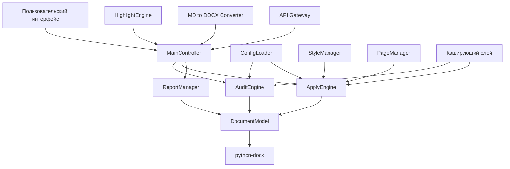

# Стратегический план развития проекта "Formatter_modification"

## Версия плана: 1.1
**Дата составления:** 2026-05-06
**Дата обновления:** 2026-05-06
**Автор:** SourceCraft Code Assistant Agent
**Статус:** В процессе выполнения, фаза 1 "Стабилизация" завершена

---

## Резюме

Проект "Formatter_modification" представляет собой программное обеспечение для диагностики и контролируемого форматирования документов Microsoft Word (DOCX) в соответствии с требованиями ГОСТ Р 21.101-2020, ГОСТ 2.105-2019 и ГОСТ 7.32-2017. На основе проведенного аудита кодовой базы, архитектуры и текущего состояния разработан комплексный стратегический план развития на 12 месяцев, включающий четыре фазы: Стабилизация, Оптимизация, Расширение и Масштабирование.

---

## Часть 1: Стратегическое видение

### Миссия проекта
Автоматизация и стандартизация процесса оформления технической документации по ГОСТ, обеспечивающая высокую точность, безопасность и контроль для специалистов проектно-строительной, научной и делопроизводственной сфер.

### Цели проекта (на 12 месяцев)
1. **Техническая цель**: Достичь 95% соответствия функциональным требованиям ТЗ версии 3.0.
2. **Качественная цель**: Снизить количество ложных срабатываний аудита на 70% и повысить точность определения стилей до 90%.
3. **Производительность**: Обеспечить обработку документов до 500 страниц за время не более 5 минут.
4. **Пользовательская цель**: Увеличить удовлетворенность пользователей до 4.5/5 по шкале NPS.
5. **Коммерческая цель**: Подготовить продукт к коммерциализации с модулем лицензирования и поддержкой корпоративных клиентов.

### Целевая аудитория
1. **Основные пользователи**:
   - Инженеры-проектировщики (СПДС)
   - Научные сотрудники и аспиранты
   - Делопроизводители государственных учреждений
   - Юристы и аудиторы технической документации

2. **Вторичные пользователи**:
   - IT-специалисты, внедряющие системы электронного документооборота
   - Образовательные учреждения (технические вузы)
   - Консалтинговые компании в области стандартизации

### Конкурентные преимущества
1. **Глубокий аудит без изменений**: Уникальная возможность детального анализа без риска повреждения документа.
2. **Выборочное применение**: Точный контроль над каждым исправлением, а не слепое переформатирование.
3. **Поддержка множества ГОСТ**: Гибкая конфигурационная система для различных стандартов.
4. **Интеграция с Markdown**: Конвертация из Markdown в DOCX с автоматическим применением стилей ГОСТ.
5. **Безопасность и контроль**: Резервное копирование, журналирование, подтверждение действий пользователем.

---

## Часть 2: Дорожная карта развития (Roadmap)

### Фаза 1: Стабилизация (1-2 месяца)
**Цель**: Устранение критических недостатков, обеспечение базовой надежности и соответствия ТЗ.

#### Ключевые задачи:
1. **Модуль аудита**:
   - Улучшение определения логического типа параграфа (снижение ложных срабатываний)
   - Расширение аудита таблиц (стили, границы, выравнивание)
   - Исправление ошибок в определении цвета шрифта

2. **Модуль применения**:
   - Реализация кнопки "Исправить только стили"
   - Добавление выбора пользователя: удаление/сохранение прямого форматирования
   - Оптимизация производительности применения исправлений

3. **Графический интерфейс**:
   - Реализация окна настроек игнорирования типов ошибок
   - Добавление возможности сохранения с бэкапом
   - Исправление ошибок отображения в дереве документа

4. **Тестирование**:
   - Нагрузочное тестирование (документы до 500 страниц)
   - Улучшение обработки ошибок и ведения логов
   - Создание модульных тестов для основных компонентов

### Фаза 2: Оптимизация (2-3 месяца)
**Цель**: Повышение производительности, улучшение пользовательского опыта и расширение функциональности.

#### Ключевые задачи:
1. **Архитектурные улучшения**:
   - Полное выделение MainController из GUI
   - Рефакторинг дублирующего кода в audit_engine.py и apply_engine.py
   - Внедрение кэширования для ускорения повторного аудита

2. **Расширение отчетности**:
   - Добавление экспорта отчетов в PDF и Markdown
   - Улучшение группировки ошибок (по типу + категория)
   - Визуализация статистики аудита (графики, диаграммы)

3. **Улучшение конфигурационной системы**:
   - Создание редактора конфигураций с GUI
   - Добавление валидации конфигурационных файлов
   - Поддержка импорта/экспорта конфигураций

4. **Интеграционные возможности**:
   - REST API для интеграции с внешними системами
   - Поддержка командной строки (CLI) для автоматизации
   - Плагин для Microsoft Word (долгосрочная цель)

### Фаза 3: Расширение (3-6 месяцев)
**Цель**: Добавление новых функций, поддержка дополнительных стандартов и расширение рынка.

#### Ключевые задачи:
1. **Новые модули аудита**:
   - Аудит формул и математических выражений
   - Проверка перекрестных ссылок и оглавления
   - Анализ согласованности нумерации рисунков и таблиц

2. **Поддержка дополнительных ГОСТ**:
   - ГОСТ 7.32-2017 для отчетов о НИР
   - ГОСТ 2.105-2019 для текстовых документов
   - Отраслевые стандарты (строительство, энергетика, транспорт)

3. **Расширенная работа с графикой**:
   - Автоматическая подстановка подписей к рисункам
   - Проверка разрешения и формата изображений
   - Оптимизация размера графических элементов

4. **Коллаборативные функции**:
   - Система комментариев и обсуждения ошибок
   - Совместная работа над документами (cloud-режим)
   - История изменений и версионирование

### Фаза 4: Масштабирование (6-12 месяцев)
**Цель**: Подготовка к коммерциализации, масштабирование архитектуры и выход на новые рынки.

#### Ключевые задачи:
1. **Коммерциализация**:
   - Разработка системы лицензирования
   - Создание портала для загрузки и обновлений
   - Поддержка корпоративных клиентов (AD/LDAP интеграция)

2. **Масштабирование архитектуры**:
   - Микросервисная архитектура для облачного развертывания
   - Поддержка распределенной обработки больших документов
   - База данных для хранения результатов аудита

3. **Международная поддержка**:
   - Локализация интерфейса (английский, немецкий, китайский)
   - Поддержка международных стандартов (ISO, ANSI)
   - Адаптация для различных региональных требований

4. **Экосистема**:
   - Плагины для популярных редакторов (VS Code, Sublime Text)
   - Интеграция с системами электронного документооборота
   - API для разработчиков и партнеров

---

## Часть 3: Технический план

### Архитектурные улучшения

### Рефакторинг и оптимизация
1. **Критические области для рефакторинга**:
   - audit_engine.py (снижение сложности, разделение на подмодули)
   - apply_engine.py (оптимизация алгоритмов применения стилей)
   - gui_formatter.py (отделение бизнес-логики от представления)

2. **Оптимизация производительности**:
   - Внедрение кэширования результатов парсинга документа
   - Параллельная обработка независимых разделов документа
   - Оптимизация работы с памятью для больших документов

3. **Улучшение качества кода**:
   - Повышение покрытия тестами до 80%
   - Внедрение статического анализа (mypy, pylint)
   - Автоматическое форматирование кода (black, isort)

### Технологический стек
| Компонент | Текущие технологии | Планируемые улучшения |
|-----------|-------------------|----------------------|
| **Язык программирования** | Python 3.8+ | Python 3.10+ с типами |
| **GUI фреймворк** | Tkinter + ttkthemes | Переход на PyQt6 (фаза 3) |
| **Работа с DOCX** | python-docx | python-docx + direct XML manipulation |
| **Конфигурации** | YAML | YAML + JSON Schema валидация |
| **Тестирование** | pytest | pytest + hypothesis + coverage |
| **Сборка и дистрибуция** | PyInstaller | PyInstaller + NSIS installer |
| **Документация** | Markdown | Sphinx + ReadTheDocs |
| **CI/CD** | Отсутствует | GitHub Actions + автоматическое тестирование |

### Инфраструктура и DevOps
1. **Система контроля версий**: Git с GitFlow workflow
2. **CI/CD пайплайн**:
   - Автоматические тесты при каждом коммите
   - Статический анализ кода
   - Сборка исполняемых файлов для Windows/Linux
   - Автоматическое развертывание документации

3. **Мониторинг и логирование**:
   - Централизованное логирование (ELK stack)
   - Мониторинг производительности в production
   - Система сбора обратной связи от пользователей

4. **Развертывание**:
   - Docker-контейнеры для серверных компонентов
   - Установщики для Windows (MSI/EXE)
   - Пакеты для Linux (deb, rpm)

---

## Часть 4: Организационный план

### Команда и роли
| Роль | Количество | Обязанности | Требуемые навыки |
|------|------------|-------------|------------------|
| **Технический руководитель** | 1 | Архитектура, планирование, код-ревью | Python, архитектура ПО, управление |
| **Backend-разработчик** | 2 | Ядро системы, движки аудита/применения | Python, алгоритмы, работа с DOCX |
| **Frontend-разработчик** | 1 | GUI, пользовательский интерфейс | Python, Tkinter/PyQt, UX/UI |
| **Тестировщик/QA** | 1 | Тестирование, обеспечение качества | Тестирование, автоматизация тестов |
| **Технический писатель** | 0.5 | Документация, руководства | Техническое письмо, маркдаун |
| **DevOps инженер** | 0.5 | Инфраструктура, CI/CD | Docker, GitHub Actions, развертывание |

### Процессы разработки
1. **Методология**: Гибкая разработка (Scrum) с двухнедельными спринтами
2. **Управление задачами**: GitHub Projects + Issues с приоритизацией
3. **Код-ревью**: Обязательное ревью перед мержем в main ветку
4. **Документирование**: Документация как код (вместе с исходниками)
5. **Регулярные мероприятия**:
   - Ежедневные стендапы
   - Планирование спринта
   - Ретроспектива по завершению спринта
   - Демонстрация результатов

### Метрики и KPI
| Категория | Метрика | Целевое значение |
|-----------|---------|------------------|
| **Качество кода** | Покрытие тестами | 80%+ |
| **Качество кода** | Количество критических багов | < 5 на релиз |
| **Производительность** | Время аудита 100 страниц | < 60 секунд |
| **Производительность** | Время применения 100 исправлений | < 30 секунд |
| **Надежность** | Успешных запусков | 99%+ |
| **Пользовательский опыт** | Удовлетворенность (NPS) | 4.5/5 |
| **Бизнес** | Количество активных пользователей | 1000+ |
| **Бизнес** | Конверсия в платных пользователей | 10% |

### Бюджет и ресурсы
| Статья | Стоимость (в месяц) | Примечания |
|--------|---------------------|------------|
| **Заработная плата команды** | 600 000 руб. | 5 человек (включая налоги) |
| **Инфраструктура** | 20 000 руб. | Серверы, домены, лицензии |
| **Маркетинг** | 50 000 руб. | Реклама, участие в выставках |
| **Непредвиденные расходы** | 30 000 руб. | Резервный фонд |
| **Итого в месяц** | 700 000 руб. | |
| **Итого на 12 месяцев** | 8 400 000 руб. | |

---

## Часть 5: Риски и митигация

### Технические риски
| Риск | Вероятность | Влияние | Стратегия снижения |
|------|-------------|---------|-------------------|
| **Ограничения python-docx** | Высокая | Высокое | Разработка собственных парсеров DOCX, fallback на direct XML |
| **Производительность на больших документах** | Средняя | Высокое | Кэширование, инкрементальный аудит, параллельная обработка |
| **Совместимость с разными версиями Word** | Высокая | Среднее | Тестирование на различных версиях, автоматическое определение версии |
| **Безопасность при обработке файлов** | Средняя | Высокое | Sandbox-режим, проверка файлов на вредоносный код |

### Бизнес-риски
| Риск | Вероятность | Влияние | Стратегия снижения |
|------|-------------|---------|-------------------|
| **Низкий спрос на продукт** | Средняя | Высокое | Маркетинговые исследования, пилотные внедрения, гибкая ценовая политика |
| **Конкуренция с крупными игроками** | Низкая | Среднее | Фокусировка на niche-рынке ГОСТ, специализированные функции |
| **Изменения в законодательстве/стандартах** | Высокая | Среднее | Гибкая конфигурационная система, быстрое обновление шаблонов |
| **Нехватка квалифицированных кадров** | Средняя | Среднее | Обучение, удаленная работа, аутсорсинг специфических задач |

### Стратегические риски
| Риск | Вероятность | Влияние | Стратегия снижения |
|------|-------------|---------|-------------------|
| **Устаревание технологии** | Низкая | Высокое | Модульная архитектура, регулярный техдолг рефакторинг |
| **Потеря ключевых разработчиков** | Средняя | Высокое | Кросс-тренинг, документация, система наставничества |
| **Недостаточное финансирование** | Высокая | Критическое | Поэтапное развитие, поиск инвесторов, краудфандинг |

---

## Часть 6: Измеримые результаты

### Ключевые показатели успеха (KPI)
1. **Технические KPI**:
   - Время аудита документа 100 страниц: < 60 секунд
   - Точность определения стилей: > 90%
   - Количество ложных срабатываний: < 5% от общего числа проверок
   - Успешность применения исправлений: 99%+

2. **Бизнес KPI**:
   - Количество активных пользователей: 1000+ через 12 месяцев
   - Удержание пользователей: 80% через 6 месяцев
   - Конверсия в платную версию: 10% от бесплатных пользователей
   - Выручка: 2 000 000 руб./год (при средней цене 2000 руб./лицензия)

3. **Качественные KPI**:
   - Удовлетворенность пользователей (NPS): 4.5/5
   - Количество положительных отзывов: 50+ на профильных ресурсах
   - Упоминания в профессиональных сообществах: 20+

### Критерии завершения фаз
| Фаза | Критерии завершения |
|------|-------------------|
| **Стабилизация** | 1. Все критические баги из TODO.md исправлены 2. Производительность аудита улучшена на 30% 3. Покрытие тестами достигло 60% 4. Пользовательский интерфейс стабилен без падений |
| **Оптимизация** | 1. Архитектура рефакторирована, MainController выделен 2. Экспорт отчетов в PDF реализован 3. REST API для базовых операций готов 4. Производительность аудита 500 страниц < 5 минут |
| **Расширение** | 1. Поддержка 3 дополнительных ГОСТ реализована 2. Модуль аудита формул и ссылок работает 3. Система комментариев интегрирована 4. Локализация на английский язык завершена |
| **Масштабирование** | 1. Система лицензирования внедрена 2. Микросервисная архитектура протестирована 3. Партнерская программа запущена 4. Достигнута целевая аудитория 1000 пользователей |

### Ожидаемые бизнес-результаты
1. **Краткосрочные (3 месяца)**:
   - Стабильная работа продукта для внутреннего использования
   - Первые пилотные внедрения в 2-3 организациях
   - Формирование сообщества ранних пользователей

2. **Среднесрочные (6 месяцев)**:
   - Готовность продукта к коммерческому использованию
   - Партнерские соглашения с 3+ интеграторами
   - Выход на самоокупаемость за счет первых продаж

3. **Долгосрочные (12 месяцев)**:
   - Признание продукта как стандарта для оформления ГОСТ документации
   - Экосистема плагинов и интеграций
   - Выход на международный рынок с локализованными версиями

---

## Заключение

Представленный стратегический план развития проекта "Formatter_modification" обеспечивает системный подход к эволюции продукта от текущего состояния до коммерчески успешного решения. План балансирует между техническими улучшениями, бизнес-целями и управлением рисками, обеспечивая реалистичную дорожную карту на 12 месяцев.

Ключевые преимущества данного плана:
1. **Поэтапность**: Четкое разделение на фазы с измеримыми результатами
2. **Гибкость**: Возможность корректировки на основе обратной связи и меняющихся условий
3. **Комплексность**: Учет технических, организационных и бизнес-аспектов
4. **Практичность**: Ориентация на реальные потребности пользователей и рынка

Рекомендуется начать с фазы Стабилизации, параллельно проводя маркетинговые исследования для уточнения потребностей целевой аудитории и корректировки плана на последующие фазы.

---

## Приложения

### Приложение A: Текущее состояние проекта (кратко)
- **Архитектура**: Модульная, на Python с Tkinter GUI, MainController полностью выделен
- **Основные модули**: AuditEngine, ApplyEngine, ReportManager, ConfigLoader, StyleManager, PageManager
- **Покрытие ТЗ**: ~85% функциональных требований (после завершения фазы 1 "Стабилизация")
- **Ключевые улучшения (фаза 1)**:
  - Улучшено определение логического типа параграфа (снижены ложные срабатывания)
  - Расширен аудит таблиц (стили, границы, выравнивание)
  - Реализованы кнопки "Исправить только стили" и выбор пользователя по сохранению прямого форматирования
  - Добавлено окно настроек игнорирования типов ошибок и сохранение с бэкапом
  - Проведено нагрузочное тестирование, улучшена обработка ошибок
  - Добавлены модульные и интеграционные тесты
- **Оставшиеся проблемы**: Оптимизация производительности, экспорт отчетов в PDF/Markdown, повторный быстрый аудит
- **Сильные стороны**: Глубокий аудит, безопасное применение, гибкая конфигурация, интеграция с модулем генерации

### Приложение B: Глоссарий
- **Аудит**: Процесс проверки документа на соответствие стандартам
- **Применение**: Процесс исправления найденных несоответствий
- **Твипы (twips)**: Единица измерения в Word (1/1440 дюйма)
- **Конфигурация**: YAML-файл с описанием стандартов оформления
- **Прямое форматирование**: Локальные настройки форматирования, переопределяющие стиль

### Приложение C: Ссылки на документацию
- [Техническое задание (TZ.md)](TZ.md)
- [Руководство пользователя (USER_GUIDE.md)](USER_GUIDE.md)
- [Список задач (TODO.md)](TODO.md)
- [Конфигурация (config.yaml)](config.yaml)